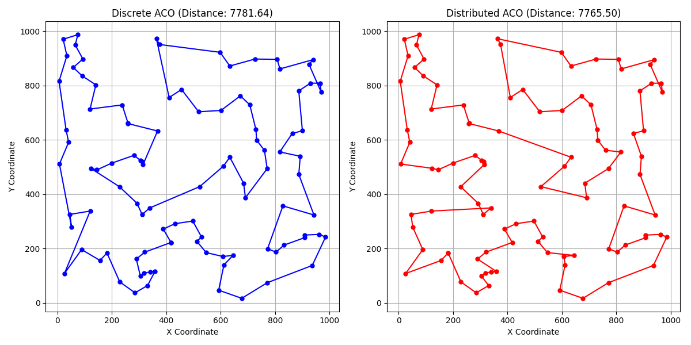
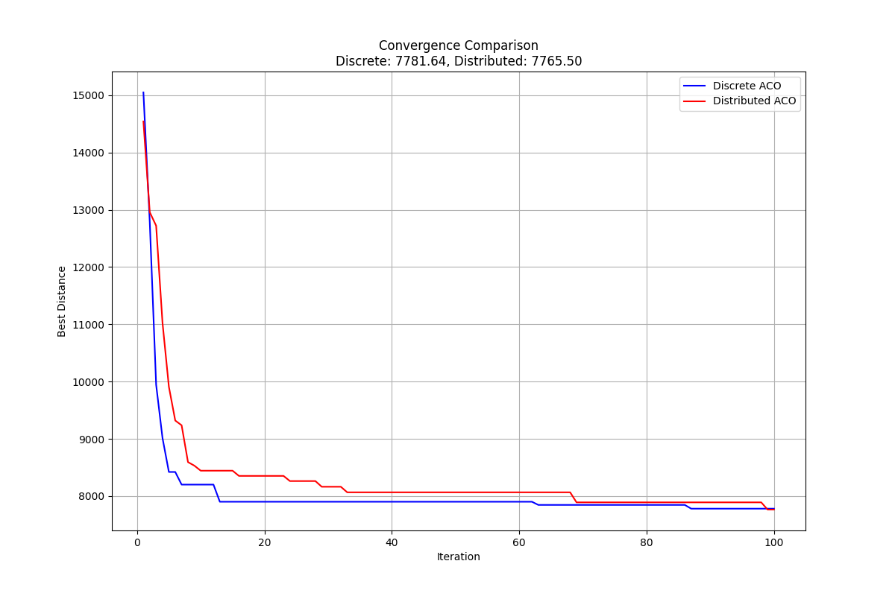

# Ant Colony Optimization for Traveling Salesman Problem

## Project Overview

This project implements two variants of Ant Colony Optimization (ACO) algorithms to solve the Traveling Salesman Problem (TSP). The implementations include:

1. **Discrete Ant Colony Optimization** - The standard ACO framework applied to the discrete optimization problem of TSP.
2. **Distributed Ant Colony Optimization** - A decentralized implementation that uses multiple colonies working in parallel with periodic information exchange.

Both algorithms are evaluated on randomly generated TSP instances, and their performances are compared in terms of solution quality and convergence speed.

## The Traveling Salesman Problem (TSP)

The Traveling Salesman Problem is a classic combinatorial optimization problem where the goal is to find the shortest possible route that visits each city exactly once and returns to the origin city. 

### Problem Formulation

- Given a set of cities and the distances between each pair of cities
- Find the shortest possible tour that visits each city exactly once and returns to the starting city

### Parameters

In our implementation, the TSP problem is controlled by the following parameters (defined in settings.py):

- `num_cities`: Number of cities in the problem (default: 100)
- `width`: Width of the coordinate grid (default: 1000)
- `height`: Height of the coordinate grid (default: 1000)
- `seed`: Random seed for reproducibility (default: 42)

## Mathematical Formulation

### Distance Calculation
For any two cities i and j with coordinates (x_i, y_i) and (x_j, y_j), the Euclidean distance is calculated as:

$$d_{ij} = \sqrt{(x_i - x_j)^2 + (y_i - y_j)^2}$$

### Transition Probability
The probability of an ant k choosing to move from city i to city j is given by:

$$p_{ij}^k = \frac{[\tau_{ij}]^\alpha \cdot [\eta_{ij}]^\beta}{\sum_{l \in N_i^k} [\tau_{il}]^\alpha \cdot [\eta_{il}]^\beta}$$

Where:
- τ_ij is the pheromone level on edge (i,j)
- η_ij is the heuristic value (usually 1/d_ij)
- α and β control the relative importance of pheromone versus distance
- N_i^k is the set of cities not yet visited by ant k

### Pheromone Update
After each iteration, the pheromone levels are updated according to:

$$\tau_{ij} \leftarrow (1-\rho) \cdot \tau_{ij} + \sum_{k=1}^m \Delta\tau_{ij}^k$$

Where:
- ρ is the evaporation rate
- m is the number of ants
- Δτ_ij^k is the pheromone deposited by ant k on edge (i,j), typically:

$$\Delta\tau_{ij}^k = \begin{cases} 
Q/L_k & \text{if ant k used edge (i,j) in its tour} \\
0 & \text{otherwise}
\end{cases}$$

Where:
- Q is a constant (pheromone deposit factor)
- L_k is the length of the tour constructed by ant k

## Ant Colony Optimization Algorithms

### Discrete Ant Colony Optimization

Discrete ACO represents the application of the standard Ant Colony Optimization framework to discrete optimization problems like the TSP. It is not a fundamentally different algorithm from the original Ant System (AS), but rather the same approach applied specifically to problems with discrete solution components.

#### Theory

In Discrete ACO, solutions are constructed by selecting discrete components one at a time (in TSP, cities to visit). The algorithm uses:

- **Pheromone trails**: Represents the learned desirability of paths based on previous solutions
- **Heuristic information**: Typically the inverse of distance between cities, representing the a priori desirability of a move. It helps ants make locally optimal decisions during path construction.

The term "Discrete" in this context refers to the domain of application (discrete/combinatorial optimization problems) rather than indicating a fundamentally different algorithm structure from the standard ACO framework.

The core algorithmic elements - probabilistic transition rules, pheromone evaporation, and update mechanisms - follow the same principles as in the original Ant System developed by Marco Dorigo, but are applied to the discrete choice of which city to visit next.

#### Parameters

- `num_ants`: Number of ants used for solution construction (default: 30)
- `alpha`: Controls the influence of pheromone trails (default: 1.0)
- `beta`: Controls the influence of heuristic information (default: 2.0)
- `rho`: Pheromone evaporation rate (default: 0.5)
- `q`: Pheromone deposit factor (default: 100)
- `max_iterations`: Maximum number of iterations (default: 100)
- `seed`: Random seed for reproducibility (default: 42)

### Distributed Ant Colony Optimization

Distributed Ant Colony Optimization uses multiple ant colonies that work independently with periodic information exchange to improve solution quality and convergence speed.

#### Theory

In Distributed ACO, multiple colonies work in parallel on the same problem. Each colony maintains its own pheromone matrix and evolves independently for a certain number of iterations. Periodically, colonies exchange information, which can be done in various ways:

- **Best solution exchange**: Colonies share their best solutions
- **Random exchange**: Colonies randomly share pheromone information

This approach combines the exploratory power of independent search with the exploitation of shared good solutions, often leading to better results than single-colony approaches.

#### Parameters

- `num_colonies`: Number of ant colonies (default: 4)
- `ants_per_colony`: Number of ants in each colony (default: 10)
- `alpha`, `beta`, `rho`, `q`: Same as for Discrete ACO
- `exchange_freq`: Frequency of information exchange between colonies (default: 10 iterations)
- `exchange_strategy`: Strategy for information exchange ('best' or 'random') (default: 'random')
- `max_iterations`: Maximum number of iterations (default: 100)
- `seed`: Random seed for reproducibility (default: 100)

## Parameter Effects and Recommended Ranges

### Alpha (α)
- **Effect**: Controls the influence of pheromone trails
- **Increasing**: Higher values make the algorithm exploit known good paths more, potentially leading to premature convergence to local optima
- **Decreasing**: Lower values reduce the importance of learned information, leading to more exploration but potentially slower convergence
- **Recommended Range**: 0.5 to 2.0
- **Optimal Value**: Often around 1.0 for balanced exploration/exploitation

### Beta (β)
- **Effect**: Controls the influence of heuristic information (distance)
- **Increasing**: Higher values make the ants greedier, preferring shorter distances regardless of pheromone levels
- **Decreasing**: Lower values reduce the importance of distance, leading to more random exploration
- **Recommended Range**: 1.0 to 5.0
- **Optimal Value**: Often around 2.0-3.0 for TSP problems

### Rho (ρ)
- **Effect**: Controls pheromone evaporation rate
- **Increasing**: Higher values cause faster evaporation, which helps prevent convergence to local optima but might slow down convergence to global optimum
- **Decreasing**: Lower values cause slower evaporation, which might lead to premature convergence but helps exploitation of good solutions
- **Recommended Range**: 0.1 to 0.9
- **Optimal Value**: Often around 0.5 for balanced forgetting rate

### Q (Pheromone Deposit Factor)
- **Effect**: Controls the amount of pheromone deposited by ants
- **Increasing**: Higher values give more weight to good solutions in pheromone updates
- **Decreasing**: Lower values make the pheromone updates more gradual
- **Recommended Range**: 10 to 1000 (depends on problem scale)
- **Optimal Value**: Often adjusted based on average tour length

### Number of Ants
- **Effect**: Controls population size
- **Increasing**: More ants provide more exploration but increase computational cost
- **Decreasing**: Fewer ants reduce computational cost but might lead to less exploration
- **Recommended Range**: Generally n to 2n where n is the number of cities
- **Optimal Value**: Often around n for balanced performance

### For Distributed ACO:

#### Number of Colonies
- **Effect**: Controls degree of parallelism
- **Increasing**: More colonies increase diversity but require more resources
- **Decreasing**: Fewer colonies reduce computational overhead but might reduce solution diversity
- **Recommended Range**: 2 to 8
- **Optimal Value**: Often around 4 for balanced performance

#### Exchange Frequency
- **Effect**: Controls how often colonies share information
- **Increasing**: Higher frequency leads to more rapid information sharing but less independent exploration
- **Decreasing**: Lower frequency allows more independent exploration but slower information propagation
- **Recommended Range**: Every 5-20 iterations
- **Optimal Value**: Often around 10 iterations for balanced performance

## Implementation Details

The project is structured as follows:

- problem: Contains TSP problem definition and city representation
  - `tsp.py`: Implements the TSP problem class
  - `city.py`: Implements the City class with coordinates
- solvers: Contains ACO algorithm implementations
  - `base.py`: Base solver class with common functionality
  - `discrete_aco.py`: Discrete ACO implementation
  - `distributed_aco.py`: Distributed ACO implementation
- settings.py: Configuration parameters for problems and algorithms
- main.py: Script to run experiments and compare solvers

## Installation Guide

1. Clone the repository:
   ```
   git clone https://github.com/Yussof-Waleed/EA-Distributed-and-Discrete-Ant-Colony-Optimization
   cd EA-Distributed-and-Discrete-Ant-Colony-Optimization
   ```

2. Create and activate a virtual environment (optional but recommended):
   ```
   python -m virtualenv venv
   source venv/bin/activate  # On Windows: venv\Scripts\activate
   ```

3. Install the required packages:
   ```
   pip install -r requirements.txt
   ```

## Usage

To run the experiments comparing Discrete ACO and Distributed ACO:

```
python main.py
```

This will:
1. Create a random TSP instance
2. Solve it using both Discrete and Distributed ACO
3. Save the results in the results directory
4. Display performance metrics for both algorithms

## Results

When you run the experiments, the following results will be generated in the results directory:

1. discrete_aco_solution.png: Visualization of the best path found by Discrete ACO
2. discrete_aco_convergence.png: Convergence graph for Discrete ACO
3. distributed_aco_solution.png: Visualization of the best path found by Distributed ACO
4. distributed_aco_convergence.png: Convergence graph for Distributed ACO
5. convergence_comparison.png: Comparison of convergence behavior between both algorithms
6. solutions_comparison.png: Side-by-side comparison of the best paths found by both algorithms

## Algorithm Comparison

The following table compares the performance of the two implemented ACO algorithms on our 100-city TSP instance:

| Algorithm | Best Distance | Execution Time | % Improvement |
|-----------|---------------|----------------|---------------|
| Discrete ACO | 7781.64 | 296.22s | - |
| Distributed ACO | 7765.50 | 295.27s | 0.21% |

## Analysis of Algorithm Differences

1. **Discrete ACO**:
   - Standard implementation of ACO for discrete/combinatorial problems
   - Uses a single colony of ants with a shared pheromone matrix
   - All ants contribute to the same pheromone updates
   - Good balance of simplicity and effectiveness for TSP

2. **Distributed ACO**:
   - Uses multiple colonies working in parallel
   - Periodic information exchange promotes diversity
   - Explores different regions of the search space simultaneously
   - Best performance due to combined exploration power and information sharing
   - Higher computational cost but typically better solutions

### Experimental Results

Our experiments on a 100-city TSP instance showed the following results:

#### Solution Comparison


As shown in the comparison, the Distributed ACO algorithm (right, red) found a slightly better solution with a total distance of 7765.50, compared to the Discrete ACO's solution (left, blue) with a distance of 7781.64.

#### Convergence Behavior


The convergence graph shows that both algorithms quickly improved their solutions in the early iterations. Discrete ACO initially found better solutions faster, but Distributed ACO eventually achieved a better final solution by the end of the optimization process.

### Analysis

Our experiments show that Distributed ACO can find marginally better solutions than Discrete ACO due to its parallel exploration strategy. The information exchange between colonies in Distributed ACO allows for better exploration of the search space, which often leads to finding better solutions, especially for larger problem instances.

In this particular run, Distributed ACO achieved a solution that was approximately 0.21% better than Discrete ACO, with a total distance of 7765.50 versus 7781.64. The execution times were very similar, with Discrete ACO taking 296.22 seconds and Distributed ACO taking 295.27 seconds.

## Glossary of Terms

- **Ant Colony Optimization (ACO)**: A nature-inspired optimization algorithm that mimics the foraging behavior of ants, where artificial ants construct solutions guided by pheromone trails and heuristic information.

- **Pheromone Trails**: Chemical substances deposited by ants to mark favorable paths. In ACO algorithms, these are numerical values that represent the learned desirability of taking specific paths based on previous solutions.

- **Heuristic Information**: Problem-specific knowledge that guides ants toward promising solutions. For TSP, this is typically calculated as 1/distance, meaning shorter paths are more desirable.

- **Evaporation Rate (ρ)**: Controls how quickly pheromone trails decay over time, preventing premature convergence to suboptimal solutions.

- **Alpha (α)**: Parameter that controls the influence of pheromone trails in decision making. Higher values make ants more likely to follow paths with strong pheromone concentration.

- **Beta (β)**: Parameter that controls the influence of heuristic information. Higher values make ants more greedy, preferring shorter paths regardless of pheromone levels.

- **Transition Probability**: The probability of an ant choosing a particular path, calculated based on both pheromone levels and heuristic information.

- **Exploitation vs. Exploration**: The balance between using already discovered good solutions (exploitation) and searching for new solutions (exploration).

- **Local Optima**: Suboptimal solutions that are better than all neighboring solutions but not the best possible solution globally.

- **Global Optima**: The best possible solution to the problem.

- **High-level Problem-solving Framework**: A general algorithmic approach that provides guidelines or strategies to develop optimization algorithms without specifying exact implementation details.

- **Stagnation**: A condition where the algorithm gets trapped in a particular solution and fails to improve further.

- **Convergence**: The process by which an algorithm progressively approaches the optimal solution over time.

- **Colony**: In distributed ACO, a group of ants that work together with their own pheromone matrix.

- **Information Exchange**: The process by which different colonies share their learned information in distributed ACO.

- **Discrete Optimization**: An optimization problem where variables take values from a discrete set (like city indices in TSP) as opposed to continuous variables.